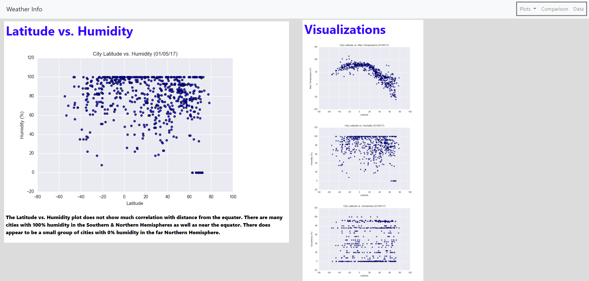
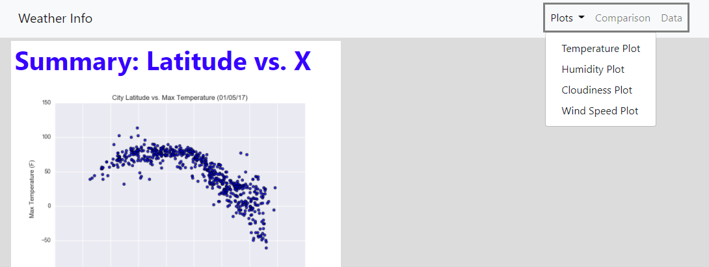

# University of Denver Data Analytics Boot Camp: Web Visualization Dashboard (Latitude)

## Latitude Analysis Dashboard with Attitude

This project consists of taking data and plots from a prior project and creating a website with multiple pages that are linked to each other. The website can be found here: 
[Web Design Challenge](https://larawayn.github.io/Web-Design-Challenge/)

### Website Requirements

The website must consist of 7 pages total, including:

* A [Landing page](#landing-page) containing:
  * An explanation of the project.
  * Links to each visualizations page. There should be a sidebar containing preview images of each plot, and clicking an image should take the user to that visualization.
* Four [Visualization pages](#visualization-pages), each with:
  * A descriptive title and heading tag.
  * The plot/visualization itself for the selected comparison.
  * A paragraph describing the plot and its significance.
* A ["Comparisons" page](#comparisons-page) that:
  * Contains all of the visualizations on the same page so we can easily visually compare them.
  * Uses a Bootstrap grid for the visualizations.
    * The grid must be two visualizations across on screens medium and larger, and 1 across on extra-small and small screens.
* A ["Data" page](#data-page) that:
  * Displays a responsive table containing the data used in the visualizations.

### Screenshots

This section contains screenshots of each page.

#### Landing page

#### Comparisons page

#### Data page

#### Visualization pages

#### Navigation menu

